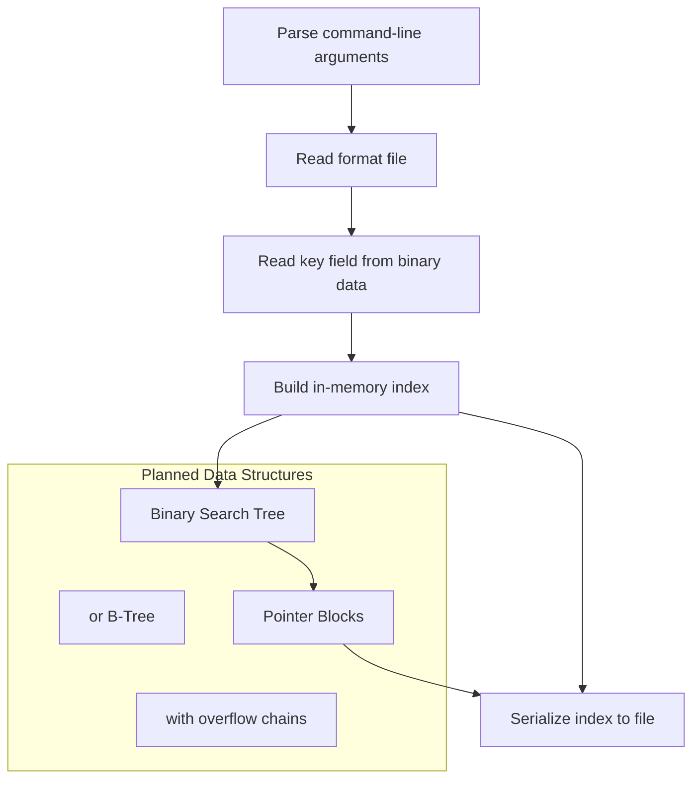

# Create Index (C++)

**A preliminary C++ console application scaffold for a file indexing tool. This project is a starter template — a minimal Win32 console application with precompiled header support, designed as the foundation for building a binary index creator for database files.**

## Project Structure

```
create-index-cpp/
├── Create_index.sln
├── Create_index/
│   ├── Create_index.cpp      # Main application entry point (stub)
│   ├── stdafx.h              # Precompiled header (Win32 includes)
│   ├── stdafx.cpp            # Precompiled header source
│   ├── ReadMe.txt            # Visual Studio generated project overview
│   ├── Create_index.vcproj   # Visual C++ project file
│   └── Create_index.vcproj.*.user  # User-specific settings
└── README.md
```

## Purpose

This project is a **preliminary scaffold** — the starting point for implementing a file indexing utility. It was intended to be expanded to:

- Read fixed-length binary record files
- Parse a format file describing record structure
- Build a searchable index (similar to the C# `create-index` project)
- Support fast lookups on key fields

## Current State

```cpp
// Create_index.cpp - Standalone stub
int _tmain(int argc, _TCHAR* argv[])
{
    return 0;
}
```

The `main()` function is currently empty — the project compiles but performs no operations. It provides the infrastructure for further development.

## Build Infrastructure

### Precompiled Headers

`stdafx.h` includes common Windows headers:
```cpp
#define WIN32_LEAN_AND_MEAN
#include <stdio.h>
#include <tchar.h>
```

This speeds up compilation by precompiling these headers. Any implementation code should include `stdafx.h` first.

### Project Configuration

- **Platform**: Win32 Console Application
- **Toolchain**: Visual C++ (VS 2008 era)
- **Unicode**: Uses `_tmain` and `_TCHAR` for Unicode/ANSI portability
- **Precompiled Header**: Enabled via `stdafx.h` / `stdafx.cpp`

## Intended Architecture

Based on the companion C# `create-index` project, this C++ version was likely intended to implement:



### Expected Concepts

- **Binary Search Tree**: Stores unique key values with left/right child pointers
- **Pointer Blocks**: Fixed-size arrays of file positions for locating records
- **Format Descriptor**: CSV-based schema definition for fixed-length records
- **Binary Serialization**: Writing the index structure to disk for later retrieval

## Development Notes

The project includes:
- Visual Studio 2008 project files (`.vcproj`, `.sln`)
- Precompiled header configured
- Unicode-aware entry point (`_tmain`)

### Potential Enhancements

To complete this project, one would add:

1. **`IndexStructure.h/.cpp`**: Binary search tree or B-tree implementation
2. **`PointerBlock.h/.cpp`**: Fixed-size pointer array with overflow handling
3. **`FormatFile.h/.cpp`**: Format file reader (CSV parser)
4. **Serialization**: Write/read index structure to/from binary files
5. **Command-line argument parsing** for file paths and parameters

## Building

Open `Create_index.sln` in Visual Studio 2008+. The project compiles as-is to a stub executable. Use Visual C++ toolchain (cl.exe) — not compatible with GCC/Clang without modifications to the precompiled header model.
